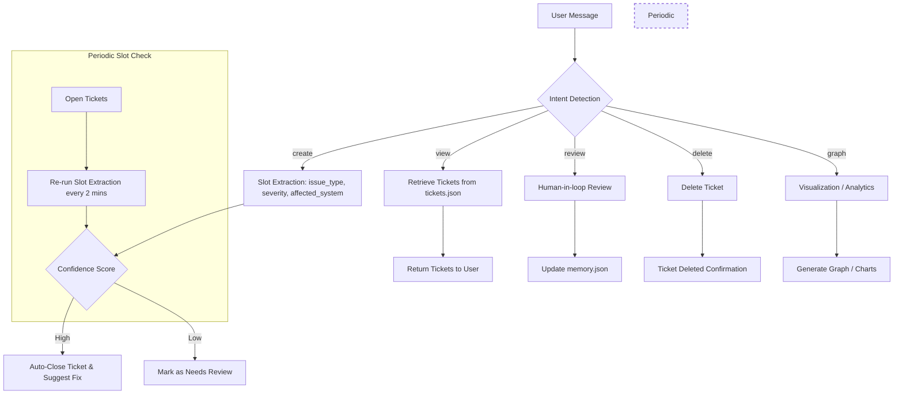

# AI-Powered Ticketing System — LangGraph Edition

An automated IT ticket management solution powered by **Azure OpenAI**, **FastAPI**, **LangGraph**, and **Streamlit**.
The system classifies, prioritizes, and resolves IT support tickets using a **graph-based workflow** instead of individual route files.

## Features

* **Graph-based Ticket Workflow** → Using LangGraph `StateGraph` for routing intents: create, view, review, delete, graph.
* **Smart Ticket Classification** → Extracts slots:

  * `issue_type` → bug, outage, incident, request, change
  * `severity` → low, medium, high, critical
  * `affected_system` → CRM, ERP, Email, Network, Database, Mobile App, Web Portal
* **Confidence Scoring** → Auto-closes tickets when AI confidence ≥ threshold; otherwise marked `needs-review`.
* **Proposed Fix Generator** → Suggests fixes for high-confidence tickets.
* **Chatbot API** → `/api/chat` endpoint handles all ticket actions via the graph.
* **Visualization Support** → Generate charts and graphs dynamically via LLM-guided analysis.
* **Human-in-the-loop Review** → Users can approve/reject/edit tickets; updates saved to `memory.json`.
* **Periodic Slot Extraction** → Every 2 minutes, open tickets are re-evaluated for updated slot extraction.

## Project Structure

```
AI-TICKETING-SYSTEM/
│
├── app/
│   ├── models/                 
│   │   └── schemas.py
│   ├── routes/                 
│   │   └── chat.py             
│   └── services/               
│       ├── slot_extractor.py
│       ├── comment_validator.py
│       └── ticket_engine.py
│
├── data/                       
│   ├── tickets.json            
│   └── memory.json             
│
├── web/                        
│   └── app.py                  
│
├── venv/                       
├── .env                        
├── requirements.txt
├── run.py                       
└── README.md
```

> **Note:** `tickets.py` route file is no longer used; all ticket logic is handled via the `StateGraph` in `chat.py`.

## Setup Instructions

```bash
git clone https://github.com/your-username/ai-ticketing-system.git
cd ai-ticketing-system

python -m venv venv
venv\Scripts\activate      # Windows
source venv/bin/activate   # Linux/Mac

pip install -r requirements.txt
```

Configure **Azure OpenAI** by creating a `.env` file:

```
AZURE_OPENAI_KEY=your_api_key_here
AZURE_OPENAI_ENDPOINT=https://your-resource-name.openai.azure.com/
```

## Running the Project

1. **Start FastAPI Backend**

```bash
uvicorn app.routes.chat:router --reload --port 8000
```

* Endpoint: `POST /api/chat` handles all ticket operations (create, view, review, delete, graph).

2. **Run Streamlit Frontend**

```bash
streamlit run web/app.py
```

* Chat UI: [http://localhost:8501](http://localhost:8501)

## Example Workflow

User submits message:
`"New ticket: CRM page crashes when saving record"`

* **Intent detected** → `create`
* **Slots extracted** → `issue_type`, `severity`, `affected_system`
* **Ticket saved with status**:

  * `closed` → high confidence
  * `needs-review` → low confidence
* **Periodic Slot Extraction**: Every 2 minutes, the system re-checks open tickets to update slot extraction.
* User can later review/edit/reject via chat.
* Visualization requests handled via `graph` intent.

## Future Enhancements

* Store tickets in **PostgreSQL/MySQL** instead of JSON.
* Enhance with **RAG knowledge base** to give automatic resolutions for tickets.
* Integration with Jira / ServiceNow.
* Analytics dashboard with proper frontend tool + Plotly.
* Docker Compose setup for FastAPI + Front end.
* Multi-agent workflows via LangGraph (additional agents for analytics, reporting, notifications).

## Chat API Example

```bash
curl -X POST "http://localhost:8000/api/chat" \
-H "Content-Type: application/json" \
-d '{"message": "Show me all high severity tickets"}'
```

## LangGraph Workflow Diagram (Mermaid)


